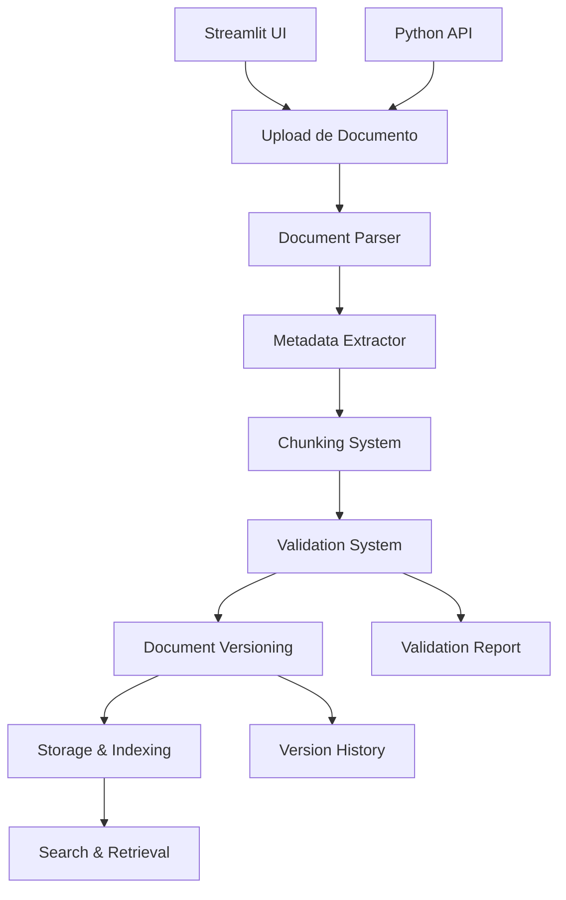

# RAG Simples - Sistema Empresarial de RAG

Sistema de Retrieval-Augmented Generation (RAG) projetado para ambientes empresariais, com pipeline completo de ingestão de documentos, processamento inteligente e validação de qualidade.

## 🚀 Características Principais

### 📄 **Pipeline de Ingestão Completo**

- **Parsers Multi-formato**: PDF, DOCX, TXT, Markdown
- **Sistema de Chunking Inteligente**: 3 estratégias (fixed_size, by_paragraph, by_sentence)
- **Extração de Metadados Automática**: entidades, estatísticas, categorização
- **Sistema de Versionamento**: controle de versões com deduplicação
- **Validação de Qualidade**: sistema abrangente de validação de dados

### 🔍 **Funcionalidades Avançadas**

- **Interface Streamlit**: upload e configuração intuitiva
- **Detecção de Duplicatas**: baseada em hash de conteúdo
- **Análise Estrutural**: headers, listas, tabelas, blocos de código
- **Categorização Automática**: 6 categorias empresariais
- **Sistema de Tags**: combinação de tags automáticas e manuais

### ✅ **Sistema de Validação**

- **4 Validadores Especializados**: Document, Content, Chunk, Metadata
- **Níveis de Validação**: BASIC, STANDARD, STRICT, CUSTOM
- **Scores de Qualidade**: 0.0 a 1.0 para cada componente
- **Relatórios Detalhados**: com recomendações e histórico

## 📁 Estrutura do Projeto

```
rag-simples/
├── src/
│   ├── ingestion/           # Pipeline de ingestão
│   │   ├── document_parser.py       # Parsers multi-formato
│   │   ├── chunking_system.py       # Sistema de chunking
│   │   ├── metadata_extractor.py    # Extração de metadados
│   │   ├── document_versioning.py   # Sistema de versionamento
│   │   ├── validation_system.py     # Sistema de validação
│   │   ├── ingestion_pipeline.py    # Pipeline integrado
│   │   └── __init__.py
│   └── ui/
│       └── streamlit_app.py         # Interface web
├── tests/                   # Testes abrangentes
├── tasks/                   # Gerenciamento de tarefas (TaskMaster)
├── scripts/                 # Scripts e configurações
├── data/                    # Dados e versões
└── requirements.txt         # Dependências

```

## 🛠️ Instalação e Configuração

### 1. **Clone o Repositório**

```bash
git clone https://github.com/brunoaquino/rag_simples.git
cd rag_simples
```

### 2. **Configuração do Ambiente**

```bash
# Criar ambiente virtual
python -m venv venv
source venv/bin/activate  # Linux/Mac
# ou
venv\Scripts\activate     # Windows

# Instalar dependências
pip install -r requirements.txt
```

### 3. **Configuração de APIs (Opcional)**

```bash
# Copiar e configurar arquivo de ambiente
cp .env.example .env
# Editar .env com suas chaves de API

# Para usar com TaskMaster (MCP):
# Editar .cursor/mcp.json com suas chaves
```

## 🎮 Como Usar

### **Interface Web (Streamlit)**

```bash
# Executar aplicação web
make run-streamlit
# ou
streamlit run src/ui/streamlit_app.py
```

**Funcionalidades da Interface:**

- Upload de múltiplos documentos
- Configuração de chunking (tamanho, sobreposição, estratégia)
- Metadados personalizados (categoria, departamento, tags)
- Visualização de resultados e estatísticas
- Busca e histórico de documentos

### **Uso Programático**

```python
from src.ingestion import IngestionPipeline, IngestionConfig

# Configuração personalizada
config = IngestionConfig(
    chunk_size=1000,
    chunk_overlap=200,
    chunking_strategy='by_paragraph',
    enable_validation=True,
    validation_level='STANDARD'
)

# Inicializar pipeline
pipeline = IngestionPipeline(config)

# Processar documento
result = pipeline.ingest_file('documento.pdf')

if result.success:
    print(f"Processado: {len(result.chunks)} chunks")
    print(f"Score de validação: {result.validation_score:.2f}")
else:
    print(f"Erro: {result.error_message}")
```

## 🧪 Testes

O projeto inclui **76 testes abrangentes** cobrindo todos os componentes:

```bash
# Executar todos os testes
pytest tests/ -v

# Testes específicos
pytest tests/test_validation.py -v      # Sistema de validação
pytest tests/test_pipeline.py -v       # Pipeline integrado
pytest tests/test_ingestion.py -v      # Componentes de ingestão
pytest tests/test_versioning.py -v     # Sistema de versionamento
```

## 📊 Componentes Detalhados

### **1. Document Parser**

- **PDF**: pdfplumber + PyPDF2 (fallback)
- **DOCX**: python-docx com extração de tabelas
- **TXT**: detecção automática de encoding
- **Markdown**: conversão opcional para HTML

### **2. Chunking System**

- **Fixed Size**: divisão por tamanho fixo
- **By Paragraph**: baseado em parágrafos
- **By Sentence**: divisão por sentenças
- **Configurável**: tamanho, sobreposição, limites mínimos

### **3. Metadata Extractor**

- **Entidades**: emails, telefones, URLs, datas
- **Estatísticas**: caracteres, palavras, parágrafos
- **Estrutura**: headers, listas, tabelas, código
- **Categorização**: 6 categorias empresariais automáticas

### **4. Validation System**

- **DocumentValidator**: arquivos, tamanhos, formatos
- **ContentValidator**: qualidade, estrutura, idioma
- **ChunkValidator**: limites, sobreposição, coerência
- **MetadataValidator**: campos obrigatórios, tipos, formatos

### **5. Versioning System**

- **Versionamento Semântico**: v1.0.0, v1.1.0, etc.
- **Deduplicação**: baseada em hash SHA-256
- **Histórico Completo**: comparação entre versões
- **Limpeza Automática**: remoção de versões antigas

## 🔧 Configurações Avançadas

### **Pipeline Configuration**

```python
config = IngestionConfig(
    # Chunking
    chunk_size=1500,
    chunk_overlap=300,
    chunking_strategy='by_paragraph',
    min_chunk_size=100,

    # Validação
    enable_validation=True,
    validation_level=ValidationLevel.STRICT,
    stop_on_validation_error=False,

    # Versionamento
    enable_versioning=True,
    storage_path="data/versions",
    max_versions_per_document=10,

    # Geral
    enable_deduplication=True,
    archive_old_versions=True
)
```

### **Validation Levels**

- **BASIC**: Validações essenciais apenas
- **STANDARD**: Validações padrão (recomendado)
- **STRICT**: Validações rigorosas
- **CUSTOM**: Regras personalizadas

## 📈 Status do Projeto

### ✅ **Implementado:**

- [x] Pipeline completo de ingestão
- [x] Sistema de parsers multi-formato
- [x] Chunking inteligente com 3 estratégias
- [x] Extração avançada de metadados
- [x] Sistema de versionamento com deduplicação
- [x] **Sistema de validação completo** 🎉
- [x] Interface Streamlit funcional
- [x] 76 testes abrangentes

### 🚧 **Em Desenvolvimento:**

- [ ] Sistema de tracking de progresso
- [ ] Integração com LLMs
- [ ] Sistema de busca semântica
- [ ] APIs REST
- [ ] Dashboard analítico

## 🤝 Contribuição

Este projeto usa **TaskMaster** para gerenciamento de tarefas:

```bash
# Verificar próxima tarefa
task-master next

# Listar todas as tarefas
task-master list

# Ver tarefa específica
task-master show <id>
```

## 📝 Licença

Este projeto está sob licença MIT. Veja [LICENSE](LICENSE) para mais detalhes.

## 🏗️ Arquitetura



---

**Desenvolvido com ❤️ para ambientes empresariais que precisam de RAG confiável e escalável.**
